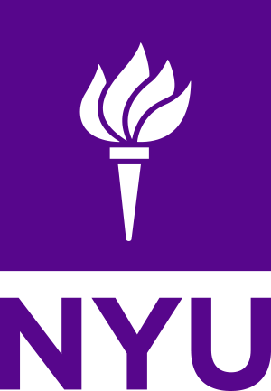

# 👋 Hello, I'm Aditya

- I'm actively looking for opportunities in the **large multimodal models + robotics** space! 
- Always open to interesting conversations and collaboration opportunities. Feel free to reach out if you'd like to chat about robotics, AI, or any exciting projects!
- Currently interested is in using **LLMs & VLMs** for perception, localization, mapping, and control for robotics & autonomous systems.

[][linkedin]
[][x]
[][email]

I'm a Machine Learning Engineer with Masters & Bachelors degrees in Engineering from [ New York University (NYU)](https://nyu.edu)  and BITS Pilani and I'm passionate about solving complex problems in:

- 🤖 **Robotics.** Machine Learning based Perception, Localization and Mapping
- 👁️ **Computer Vision.** Object Detection, Semantic Segmentation, 3D Reconstruction & Neural Rendering, Optical Flow, Tracking
- 🧠 **Machine Learning.** CNNs, Transformers, Diffusion Models, AutoEncoders

## 🚀 What I Bring to the Table

I posess a strong progamming ability and an in-depth understanding of concepts machine learning, 2d & 3d computer vision, perception, localization and mapping (SLAM).

## 🛠️ Tech Stack
This is a non-exhaustive list of the technologies I have used in the past and I am profesionally competent in.

| Languages                                                                                                    | Frameworks & Libraries                                                                                                                                                                                                                                                                                                                                                                              | Currently Learning                       |
| ------------------------------------------------------------------------------------------------------------ | --------------------------------------------------------------------------------------------------------------------------------------------------------------------------------------------------------------------------------------------------------------------------------------------------------------------------------------------------------------------------------------------------- | ---------------------------------------- |
| ![Python][python-shield] ![C++][cpp-shield] ![C][c-shield] ![MATLAB][matlab-shield] ![Bash][bash-shield] ![CUDA][cuda-shield] ![HTML][html-shield] ![CSS][css-shield] ![JavsScript][js-shield]| ![PyTorch][pytorch-shield] ![OpenCV][opencv-shield] ![Open3D][open3d-shield] ![Keras][keras-shield] ![TensorFlow][tensorflow-shield] ![PyTorch Lightning][lightning-shield] ![Hugging Face][huggingface-shield] ![CMake][cmake-shield] ![Eigen][eigen-shield] ![TensorRT][tensorrt-shield] ![NumPy][numpy-shield] ![SciPy][scipy-shield] ![pandas][pandas-shield] | ![Rust][rust-shield] ![JAX][jax-shield] |

## 📊 GitHub Stats

[linkedin]: https://www.linkedin.com/in/adityamwagh
[x]: https://www.x.com/adityamwagh
[email]: mailto:adityamwagh@outlook.com
[python-shield]: https://img.shields.io/badge/Python-3670A0?style=flat&logo=python&logoColor=ffdd54
[cpp-shield]: https://img.shields.io/badge/C++-00599C?style=flat&logo=cplusplus&logoColor=white
[html-shield]: https://img.shields.io/badge/HTML-E34F26?style=flat&logo=html5&logoColor=white
[css-shield]: https://img.shields.io/badge/CSS-1572B6?style=flat&logo=css3&logoColor=white
[js-shield]: https://img.shields.io/badge/JavaScript-F7DF1E?style=flat&logo=javascript&logoColor=black
[opencv-shield]: https://img.shields.io/badge/OpenCV-%23white.svg?style=flat&logo=opencv&logoColor=white
[rust-shield]: https://img.shields.io/badge/Rust-D2691E?style=flat&logo=rust&logoColor=white
[pytorch-shield]: https://img.shields.io/badge/PyTorch-%23EE4C2C.svg?style=flat&logo=PyTorch&logoColor=white
[jax-shield]: https://img.shields.io/badge/JAX-007FFF?style=flat&logo=google&logoColor=white
[c-shield]: https://img.shields.io/badge/C-00599C?style=flat&logo=c&logoColor=white
[open3d-shield]: https://img.shields.io/badge/Open3D-%23white.svg?style=flat&logoColor=white
[matlab-shield]: https://img.shields.io/badge/MATLAB-%23white.svg?style=flat&logo=https://upload.wikimedia.org/wikipedia/commons/2/21/Matlab_Logo.png&logoColor=white
[keras-shield]: https://img.shields.io/badge/Keras-%23D00000?style=flat&logo=Keras&logoColor=white
[cuda-shield]: https://img.shields.io/badge/CUDA-%2300C853?style=flat&logo=nvidia&logoColor=white
[tensorflow-shield]: https://img.shields.io/badge/TensorFlow-%23FF6F00.svg?style=flat&logo=TensorFlow&logoColor=white
[bash-shield]: https://img.shields.io/badge/GNU%20Bash-4EAA25?style=flat&logo=gnu-bash&logoColor=white
[lightning-shield]: https://img.shields.io/badge/PyTorch_Lightning-792EE5?style=flat&logo=pytorch-lightning&logoColor=white
[huggingface-shield]: https://img.shields.io/badge/Hugging_Face-fee133?style=flat&logo=huggingface&logoColor=black
[cmake-shield]: https://img.shields.io/badge/CMake-064F8C?style=flat&logo=cmake&logoColor=white
[eigen-shield]: https://img.shields.io/badge/Eigen-0578C1?style=flat&logo=eigen&logoColor=white
[tensorrt-shield]: https://img.shields.io/badge/TensorRT-%2300C853?style=flat&logo=nvidia&logoColor=white
[numpy-shield]: https://img.shields.io/badge/NumPy-%23013243?style=flat&logo=numpy&logoColor=white
[scipy-shield]: https://img.shields.io/badge/SciPy-%23045a73?style=flat&logo=scipy&logoColor=white
[pandas-shield]: https://img.shields.io/badge/pandas-%23150458.svg?style=flat&logo=pandas&logoColor=white
